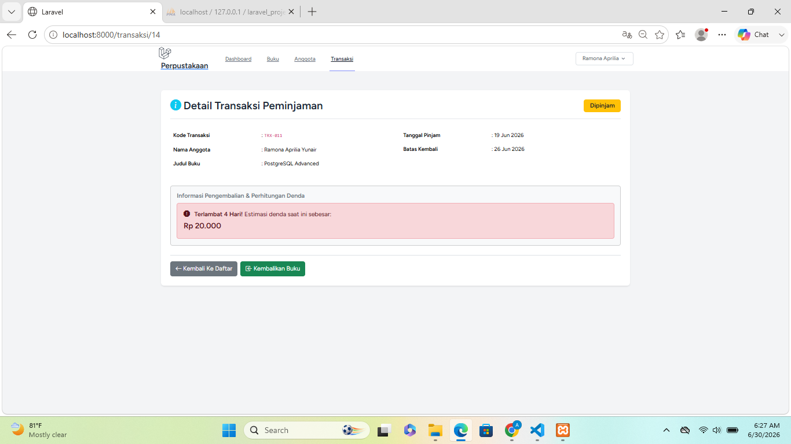
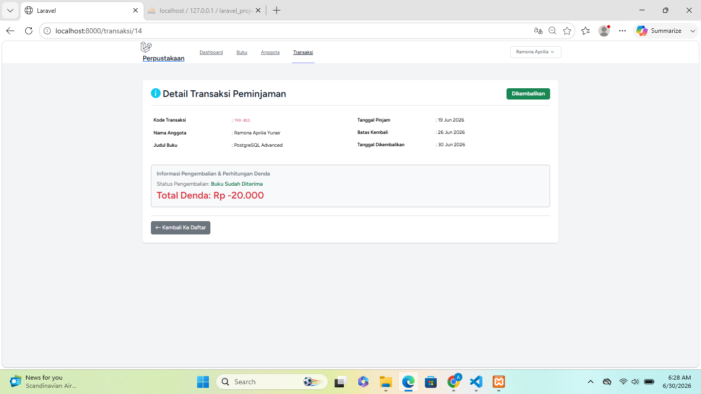
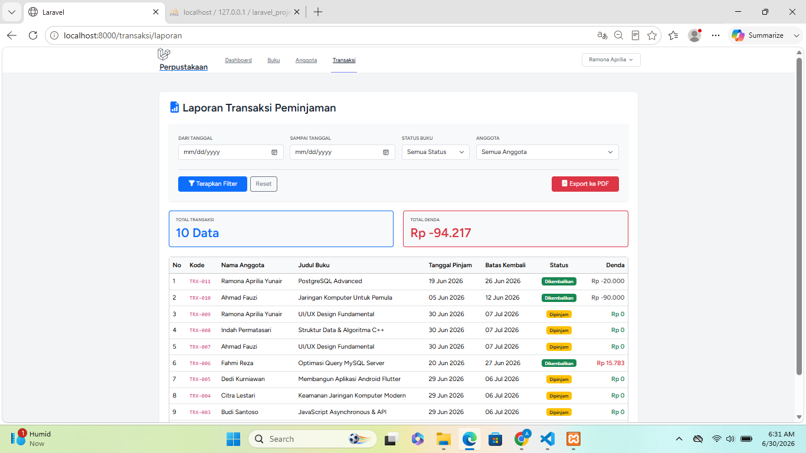
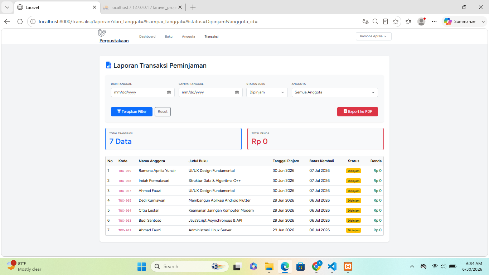
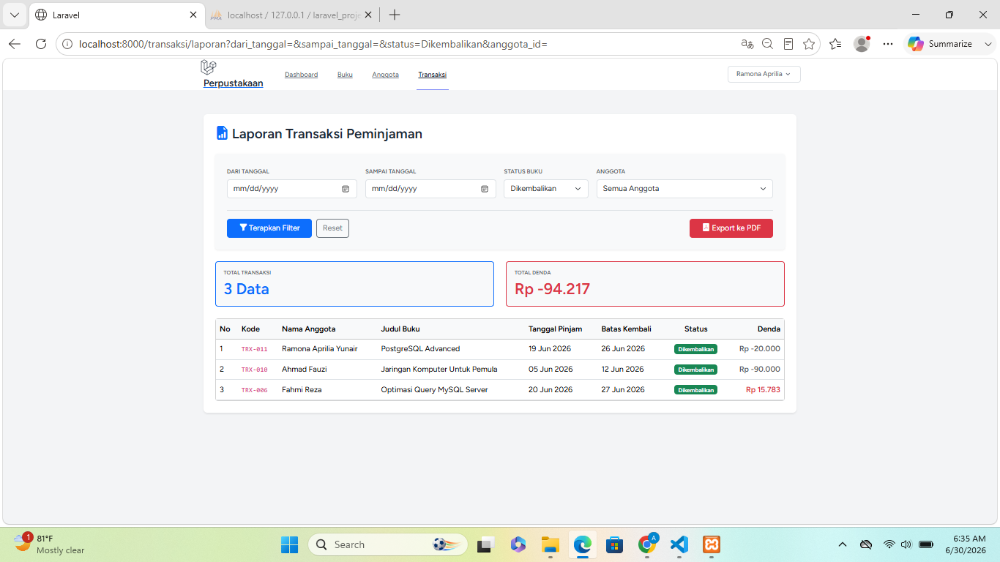
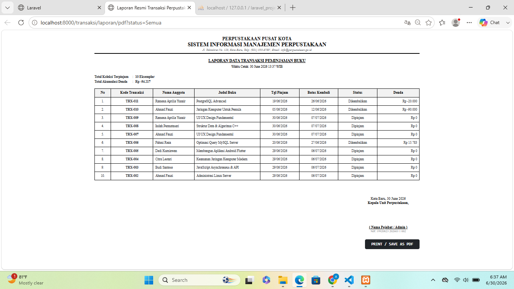
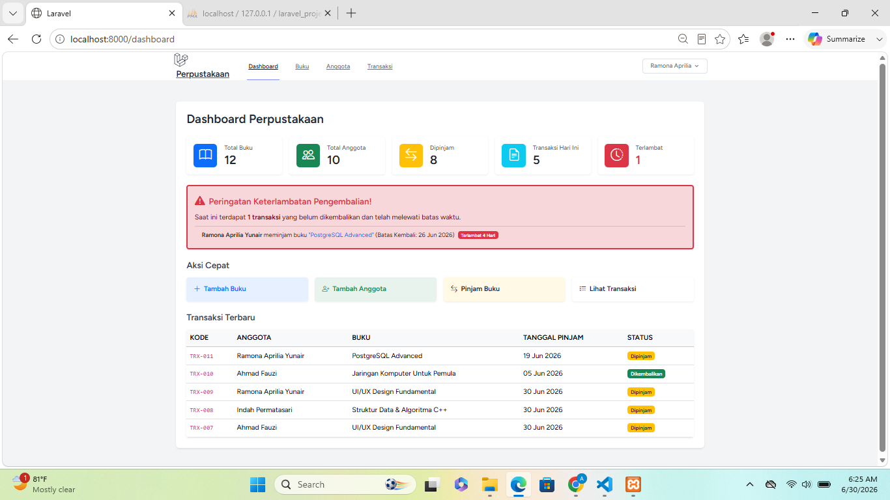
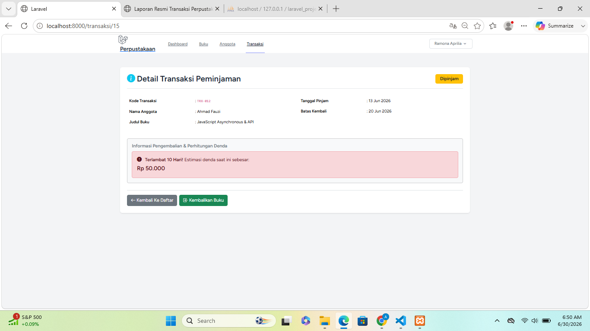
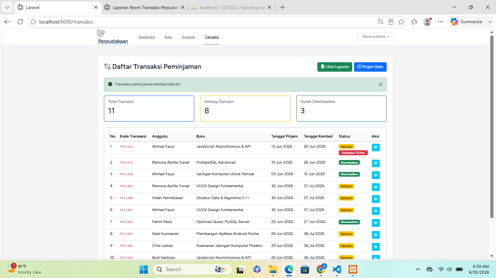

# Tugas Pertemuan 14 - Authentication & Transaksi Peminjaman

---

**Nama:** Ramona Aprilia Yuniar  
**NIM:** 60324039
**Prodi:** Informatika  
**Semester:** 4  
**Mata Kuliah:** Pemrograman Web II
**Link Repository:** [https://github.com/ramonaapriliayuniar55/PERTEMUAN-14-Authentication-Transaksi-Peminjaman.git]


---

# Tugas 1 - Fitur Pengembalian Buku

## 1. View Detail Transaksi dengan Button "Kembalikan Buku"

Halaman detail transaksi menyediakan tombol *Kembalikan Buku* untuk memproses pengembalian buku.

### Screenshot



---

## 2. Method `kembalikan()` pada Controller

Method `kembalikan()` berfungsi untuk:

- Mengubah status transaksi menjadi **Dikembalikan**
- Mengisi tanggal pengembalian
- Menghitung denda apabila terlambat
- Menambah stok buku sebanyak 1

---

## 3. Perhitungan Denda

Ketentuan denda:

- Rp5.000/hari
- Hanya dikenakan jika terlambat
- Total denda ditampilkan pada detail transaksi

### Screenshot



---

## 4. Update Stok Buku

Setelah buku dikembalikan, stok buku otomatis bertambah sebanyak **1** sehingga dapat dipinjam kembali.

---

# Tugas 2 - Laporan Transaksi

## 1. Route

```
/transaksi/laporan
```

---

## 2. Filter

- Range tanggal
- Status Semua
- Status Dipinjam
- Status Dikembalikan
- Anggota

### Halaman Laporan



### Filter Status Dipinjam



### Filter Status Dikembalikan



---

## 3. Tampilan

Halaman laporan menampilkan:

- Tabel transaksi
- Total transaksi
- Total denda


---

## 4. Export PDF

### Screenshot



---

# Tugas 3 - Notifikasi Terlambat

## 1. Dashboard Widget

Menampilkan:

- Card Buku Terlambat
- Jumlah transaksi terlambat
- List anggota yang terlambat

### Screenshot



---

## 2. Badge Terlambat

Pada halaman transaksi ditampilkan badge **Terlambat** beserta jumlah hari keterlambatan.

### Screenshot



---

## 3. Reminder

Pada detail transaksi akan muncul warning apabila melewati tanggal kembali.

### Screenshot



